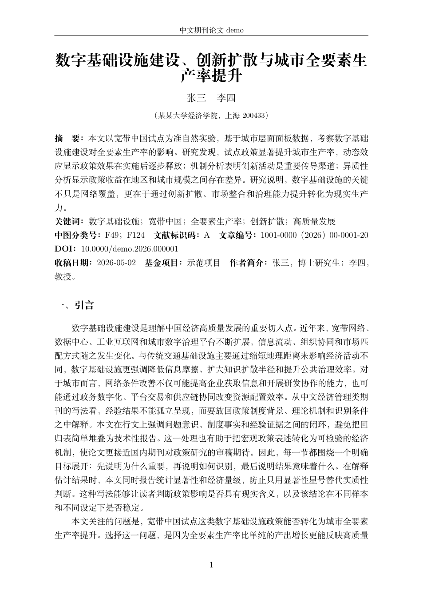

# Auto-Eco

Auto-Eco 是一套面向计量经济学论文写作的自动科研流水线。当前版本的重点是：先围绕研究问题建立任务清单，再按“资料、数据、识别、实证、论文成文、质量检查”的顺序循环迭代，直到达到可交付标准。

系统默认面向中文经济学、管理学和公共政策类期刊写作，而不是只生成一份简单的报告。论文成文阶段会按中文期刊常见结构展开，要求正文中文字符数达到 10000 字以上，参考文献、图表、公式和附录不计入正文长度。

## Demo

GitHub 的 `README.md` 不能像普通网页一样稳定内嵌 PDF 阅读器；仓库里的 `mp4` 也不一定会在 README 中原生播放。这里采用纯 Markdown 的稳定做法：视频提供直接播放入口，PDF 提供首页预览图和原文链接。

### 演示视频

[点击播放 demo.mp4](./demo.mp4)

### 最新 PDF

[](./demo_eco/final_package/paper/paper.pdf)

[打开完整 PDF](./demo_eco/final_package/paper/paper.pdf)

示例最终交付包位于：[demo_eco/final_package/](./demo_eco/final_package/)。

## 当前能力

- 循环式科研流程：自动维护 `ECO_PIPELINE_TODO.md` 和 `ECO_PIPELINE_QA.md`，每个阶段都有目标、状态和返工条件。
- 数据与实证分析：输出描述统计、基准回归、稳健性、异质性、机制分析、图表和结果解释。
- Stata 复现代码：最终交付包中生成 `analysis.do`，用于复现实证流程。
- 中文论文成文：按国内期刊行文习惯组织摘要、引言、制度背景、文献综述、理论机制、研究设计、实证结果、进一步分析、结论与政策启示。
- 论文格式控制：统一三线表、显著性星号、表下注释、英文变量中文解释、参考文献 `[1]` 编号格式。
- 字数与质量检查：生成 `WORD_COUNT_CHECK.md`，检查正文中文字符数是否达到 10000 字要求。
- 最终打包：PDF、LaTeX 源文件、Stata 代码、表格、图形、过程文档和 QA 文件会同步到 `final_package/`。

## 系统逻辑

完整系统说明见：[docs/system_overview.md](./docs/system_overview.md)。

核心流程如下：

```text
研究主题/数据
  -> 建立全局 TODO 与 QA 标准
  -> 数据画像与变量识别
  -> 背景、政策与文献材料整理
  -> 识别策略与实证分析
  -> 图表和 Stata 复现代码生成
  -> 分章节扩写中文论文
  -> 字数、格式、引用和图表检查
  -> PDF 编译
  -> final_package 打包
```

每个阶段都不是一次性生成后结束，而是根据目标清单检查是否达标。未达标时会回到相应阶段继续补充，例如正文不足 10000 字会继续扩写各章节，表格格式不统一会回到表格生成环节修正。

## Demo 目录

当前示例使用 `demo_eco/broadband_china.csv` 生成，主要输出如下：

```text
demo_eco/
├── broadband_china.csv
├── analysis.do
├── paper.tex
├── paper.pdf
├── WORD_COUNT_CHECK.md
├── ECO_PIPELINE_TODO.md
├── ECO_PIPELINE_QA.md
├── ECO_ANALYSIS_TODO.md
├── ECO_ANALYSIS_QA.md
├── tables/
├── sections/
└── final_package/
    ├── README.md
    ├── paper/
    │   ├── paper.pdf
    │   └── paper.tex
    ├── code/
    │   └── analysis.do
    ├── tables/
    ├── docs/
    └── qa/
```

## Skills

本项目的核心能力通过 `skills/` 目录组织：

| Skill | 作用 |
| --- | --- |
| `eco-pipeline` | 总控流程，负责阶段编排、TODO/QA 循环和最终打包 |
| `eco-analysis` | 数据分析、计量模型、表格图形和 Stata 代码生成 |
| `eco-write-paper` | 中文期刊论文成文、格式控制、正文扩写和 PDF 输出 |
| `eco-data-explore` | 数据读取、变量识别、样本结构和可行性判断 |
| `eco-background` | 政策背景、制度背景和现实依据整理 |
| `eco-lit-review` | 文献综述和理论脉络整理 |
| `eco-ref-verify` | 参考文献核验与引用一致性检查 |
| `eco-contribution` | 边际贡献和研究定位提炼 |
| `eco-idea` | 研究问题、识别思路和初始选题生成 |

## 快速使用

将数据放入项目目录后，可以按主题运行完整流程：

```text
/eco-pipeline "研究主题或 auto" "项目目录"
```

也可以单独调用论文成文阶段：

```text
/eco-write-paper "项目目录"
```

如果需要重新生成示例，可以运行：

```powershell
python demo_eco\run_new_demo.py
demo_eco\tectonic.exe demo_eco\paper.tex
```

## 输出标准

- 中文正文不少于 10000 字，且不把摘要、参考文献、表格、公式、附录计入正文。
- 参考文献一般不少于 20 篇，并使用中文期刊常见的 `[1]` 编号格式。
- 表格采用中文三线表风格，显著性星号和标准误说明完整。
- 表格中的英文变量名必须在表注或变量说明中解释。
- PDF、源文件、代码和过程文档必须同步进入 `final_package/`。

## 说明

本项目不是自动保证论文可发表的系统。它的目标是把计量经济学论文生产中的资料整理、实证分析、论文成文、格式检查和打包交付流程结构化，减少低质量一次性生成，提升迭代修改的稳定性。
